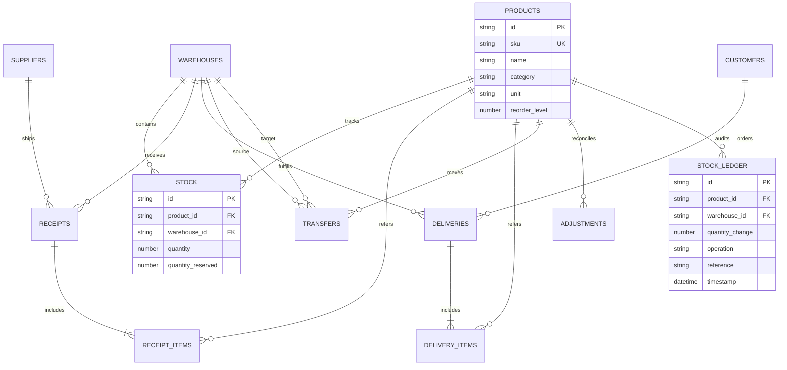

# FLUXO — Where Stock Flows Smarter ⚡

[](https://nextjs.org/)
[](https://reactjs.org/)
[](https://www.typescriptlang.org/)
[](https://tailwindcss.com/)
[](https://github.com/pmndrs/zustand)
[](LICENSE)

**FLUXO** is an enterprise-grade, Apple-inspired Intelligent Warehouse Logistics & Inventory Orchestration System. Built for high-frequency multi-warehouse operations, FLUXO unifies inbound receiving, outbound delivery pipelines, inter-warehouse transfers, inventory reconciliation adjustments, and real-time audit ledger tracking with sub-millisecond responsiveness and state-of-the-art dark mode visual polish.

---

## 📖 Table of Contents
- [1. Project Overview](#1-project-overview)
- [2. Getting Started](#2-getting-started)
- [3. API Documentation](#3-api-documentation)
- [4. Frontend Architecture & Guide](#4-frontend-architecture--guide)
- [5. Database Schema & ERD](#5-database-schema--erd)
- [6. Deployment](#6-deployment)
- [7. Contributing](#7-contributing)

---

## 1. Project Overview

### What is FLUXO?
FLUXO bridges the gap between complex industrial supply chain backend operations and effortless, hyper-responsive frontend user experiences. It monitors inventory movements across global fulfillment nodes with real-time health scoring, stock reservation, low-stock warnings, and automated audit logging.

### Key Features
- 📊 **Real-Time KPI Dashboard**: Dynamic warehouse distribution charts, live activity feeds, operations trend summary, and automated health score ring.
- 📦 **Products Catalog Management**: Multi-location stock breakdown per SKU, customizable reorder levels, real-time debounced search, and category filtering.
- 📥 **Inbound Receipts Workflow**: Multi-step steppers from `DRAFT` → `RECEIVED` → `VALIDATED` → `COMPLETED` with automated stock increment.
- 🚚 **Outbound Deliveries Pipeline**: Kanban/Pipeline status tracker (`DRAFT` → `PICKING` → `PACKING` → `SHIPPED` → `DELIVERED`) with real-time stock reservation and release.
- 🔀 **Inter-Warehouse Transfers**: Seamless transfer requests, manager approvals, and automated balance synchronization across source and target warehouses.
- ⚖️ **Reconciliation Adjustments**: Audit queue for stock counts, variance calculation (`quantity_diff`), and supervisor authorization.
- 📜 **Stock Ledger Audit Trail**: Immutable chronological log of all stock movements with exportable report metrics.
- ⚡ **Apple-Level Performance**: 300ms debouncing, request cancellation via `AbortController`, 5-min TTL query caching, `React.memo` list optimization, and Web Vitals tracking.

### Tech Stack
- **Framework**: Next.js 16.3 (App Router), React 19.2
- **Language**: TypeScript 5 (Strict Type Safety)
- **Styling**: TailwindCSS 4, Framer Motion 13, Glassmorphism, SF Pro Font Typography
- **State Management**: Zustand 5 with atomic selector hooks & local storage caching
- **HTTP Client**: Axios 1.20 with request/response interceptors & custom error mapping
- **Charts & Icons**: Recharts 3.10, Lucide React 1.48

---

## 2. Getting Started

### Prerequisites
- **Node.js**: `v20.0.0` or higher
- **npm**: `v10.0.0` or higher (or `pnpm` / `yarn`)
- **Backend Service**: Python FastAPI / PostgreSQL (running on `http://localhost:8000` by default)

### Installation

1. **Clone the repository**:
   ```bash
   git clone https://github.com/soha-nabi/fluxo-Where-Stock-Flows-Smarter.git
   cd fluxo-Where-Stock-Flows-Smarter
   ```

2. **Install dependencies**:
   ```bash
   npm install
   ```

3. **Configure Environment Variables**:
   Create a `.env.local` file in the root directory:
   ```env
   NEXT_PUBLIC_API_URL=http://localhost:8000
   NEXT_PUBLIC_SENTRY_DSN=https://mock@sentry.io/123456
   ```

4. **Run Development Server**:
   ```bash
   npm run dev
   ```
   Open [http://localhost:3000](http://localhost:3000) in your browser.

---

## 3. API Documentation

### Base URL
```
http://localhost:8000/api/v1
```

### Authentication
All requests attach a JWT Bearer token via Axios request interceptor:
```http
Authorization: Bearer <your_jwt_token>
```

### Key API Endpoints

| Resource | Method | Endpoint | Description |
| :--- | :--- | :--- | :--- |
| **Products** | `GET` | `/api/v1/products` | Get paginated products with search & category filters |
| **Products** | `POST` | `/api/v1/products` | Create a new SKU product record |
| **Products** | `GET` | `/api/v1/products/{id}` | Get product details & warehouse breakdown |
| **Receipts** | `GET` | `/api/v1/receipts` | List inbound shipment receipts |
| **Receipts** | `POST` | `/api/v1/receipts/{id}/validate` | Validate receipt quality check |
| **Receipts** | `POST` | `/api/v1/receipts/{id}/complete` | Complete receipt & post stock to inventory |
| **Deliveries**| `GET` | `/api/v1/deliveries` | List outbound delivery orders |
| **Deliveries**| `POST` | `/api/v1/deliveries/{id}/ship` | Ship delivery order & post ledger debit |
| **Transfers** | `POST` | `/api/v1/transfers` | Create inter-warehouse transfer request |
| **Adjustments**|`POST` | `/api/v1/adjustments/{id}/execute`| Execute stock count adjustment variance |
| **Dashboard** | `GET` | `/api/v1/dashboard/kpis` | Fetch aggregated warehouse KPIs |

### Structured Error Responses
All errors are normalized into standard JSON responses:
```json
{
  "status": "error",
  "message": "SKU already exists in database",
  "statusCode": 422,
  "errors": {
    "sku": ["Duplicate entry found"]
  }
}
```

---

## 4. Frontend Architecture & Guide

### Directory Structure
```
c:\FLUXO\
├── public/                # Static images & fonts
├── src/
│   ├── app/               # Next.js App Router pages (16 workflow routes)
│   │   ├── page.tsx       # Main Dashboard
│   │   ├── products/      # Catalog & Detail pages
│   │   ├── receipts/      # Receipts List, New, Detail
│   │   ├── deliveries/    # Deliveries Pipeline, New, Detail
│   │   ├── transfers/     # Transfers List, New, Detail
│   │   ├── adjustments/   # Audit Queue, New, Detail
│   │   └── reports/       # Tabbed Analytics
│   ├── components/        # Reusable visual components
│   │   ├── common/        # OptimizedImage, VirtualList, ErrorBoundary, FilterBar
│   │   ├── display/       # KPICard, HealthRing, WarehouseCard, LiveActivityFeed
│   │   ├── forms/         # ReceiptForm, DeliveryForm, TransferForm, ProductForm
│   │   ├── modals/        # Action Modals
│   │   ├── tables/        # ProductsTable, ReceiptsTable, DeliveriesTable, etc.
│   │   └── workflow/      # Status Stepper Components
│   ├── db/                # SQL Indexing & Materialized View Scripts
│   ├── hooks/             # Custom Hooks (useDebounce, useLocalStorageCache, etc.)
│   ├── lib/               # Core Utilities (api.ts, cache.ts, vitals.ts, logger.ts)
│   ├── store/             # Zustand Stores & Atomic Selectors
│   └── styles/            # Design System Tokens & Animations
└── next.config.ts         # Next.js Performance & Asset Caching Config
```

### State Management Guidelines
Subscribe to Zustand stores using **Atomic Selectors** to avoid component re-renders:
```tsx
import { useProductsList, useProductLoading } from "@/store";

export function ProductCatalog() {
  const products = useProductsList();
  const loading = useProductLoading();
  // Only re-renders when products or loading states change
}
```

---

## 5. Database Schema & ERD



---

## 6. Deployment

### Production Build
Execute Next.js production build check:
```bash
npm run build
npm run start
```

### Environment Variables Matrix
| Variable | Required | Default | Description |
| :--- | :---: | :--- | :--- |
| `NEXT_PUBLIC_API_URL` | Yes | `http://localhost:8000` | Backend API base URL |
| `NEXT_PUBLIC_SENTRY_DSN` | No | — | Sentry error tracking endpoint |

### Database Migration
Run PostgreSQL index optimizations before deploying to production:
```bash
psql -h localhost -U postgres -d fluxo_db -f src/db/indexes.sql
```

---

## 7. Contributing

1. **Code Style**: Follow strict TypeScript standards. Ensure `npx tsc --noEmit` passes cleanly.
2. **Git Commit Conventions**:
   - `feat:` New features or UI components
   - `fix:` Bug fixes and patch releases
   - `perf:` Performance optimizations and caching changes
   - `test:` Integration test suites
3. **Testing Requirements**:
   Run integration tests prior to opening Pull Requests:
   ```bash
   npx ts-node src/__tests__/index.ts
   ```

---

*Made with ❤️ by the FLUXO Engineering Team.*
